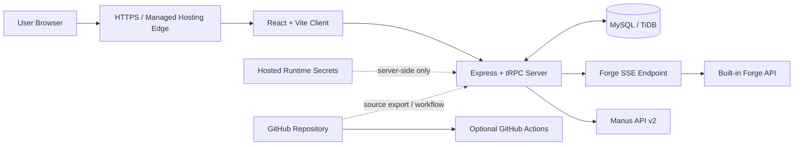

# Autonomous AI Hub — Sample Full-Stack Deployment Architecture

This architecture keeps the conversational interface, protected server-side orchestration logic, persistent state, and AI credentials in a managed full-stack environment. The browser only receives the client application and an authenticated session; provider credentials remain server-side. GitHub stores and validates the codebase, but it does not replace the runtime because this application needs an API server, database access, OAuth callbacks, and secure secret handling.

| Layer | Responsibility | Main security rule |
| --- | --- | --- |
| Browser | Manus OAuth sign-in, branch chat, visible token stream | Never contains provider or database credentials. |
| Managed app runtime | React delivery, Express/tRPC API, SSE proxy, ownership enforcement | Validates session and ownership before every sensitive operation. |
| Data layer | User records, branch conversations, messages, task state | Stores durable state; does not store provider keys. |
| Provider layer | Built-in Forge streaming and Manus asynchronous tasks | Called only from server-side code. |
| Secrets boundary | Forge and Manus credentials, JWT/OAuth configuration | Injected by the host at runtime, never committed to GitHub. |
| GitHub workflow | Source control, testing, review, optional CI | Suitable for code delivery—not a substitute for the server runtime. |

> **Recommended production path:** Use managed full-stack hosting for the live application, connect a custom domain when ready, and keep GitHub as the source-control and CI system. Do not deploy this version to static-only GitHub Pages, because the server, database, OAuth callback, and secrets would not be available there.
